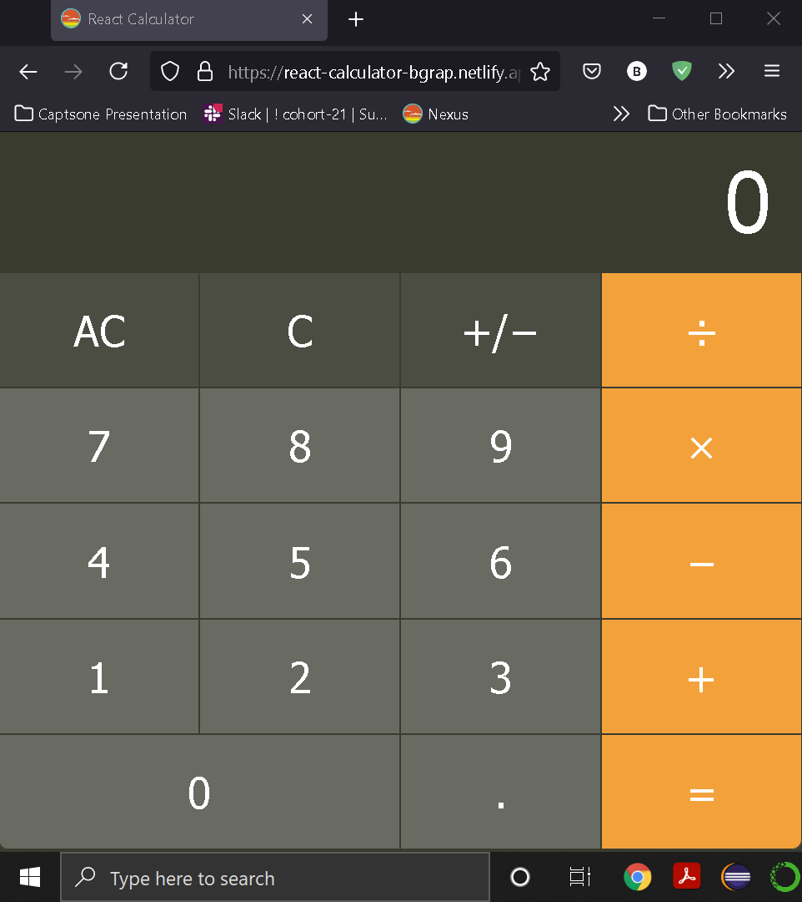

# React Calculator
## https://react-calculator-bgrap.netlify.app/

<!--

Practice is key to gaining the mileage needed to conquer programming. A very common practice problem is to recreate a working calculator. A basic calculator is a good exercise in using state, effects, and components to create a powerful and robust UI.

Objectives

- Practice using functional components with hooks

- Practice implementing a UI wire-frame

Requirements

Create a simple calculator that allows the user to add, multiply, subtract, and divide two numbers. Here is a sample UI:

Notes
Take this in small steps just like we did in class. Start with the HTML, then CSS, then with basic functionality.

Explorer Mode

    - Implement something similar to the example UI using HTML and CSS inside a React app

<!-- DONE

    - As a user, I should be able to add two numbers

<!-- DONE

    - As a user, I should be able to subtract numbers

<!-- DONE

    - As a user, I should be able to add multiple numbers

<!-- DONE

    - As a user, I should be able to divide numbers

<!-- DONE

    - The clear button should reset the current calculation

<!-- DONE

add guard clauses for incorrect input -> more than one decimal point

<!-- DONE

Adventure Mode

    - Show the user their history in a list

<!-- DONE

    - Be able to chain together results. For example, the user should be able to input 2 + 3 - 4 + 5 and get the correct answer

<!-- DONE -->

<!-- - Let the user use their keyboard in addition to the mouse -->

<!-- Epic Mode -->

<!-- Using your systems calculator app as inspiration, implement as many features as you can, including, but not limited to scientific mode, exponents, and the order of operations. -->

<!-- update display when result known during performance of normal operations (not incrementing) instead of displaying zero to match the apple calculator -->

<!-- use before in css to change display symbols -->

<!-- DONE -->
